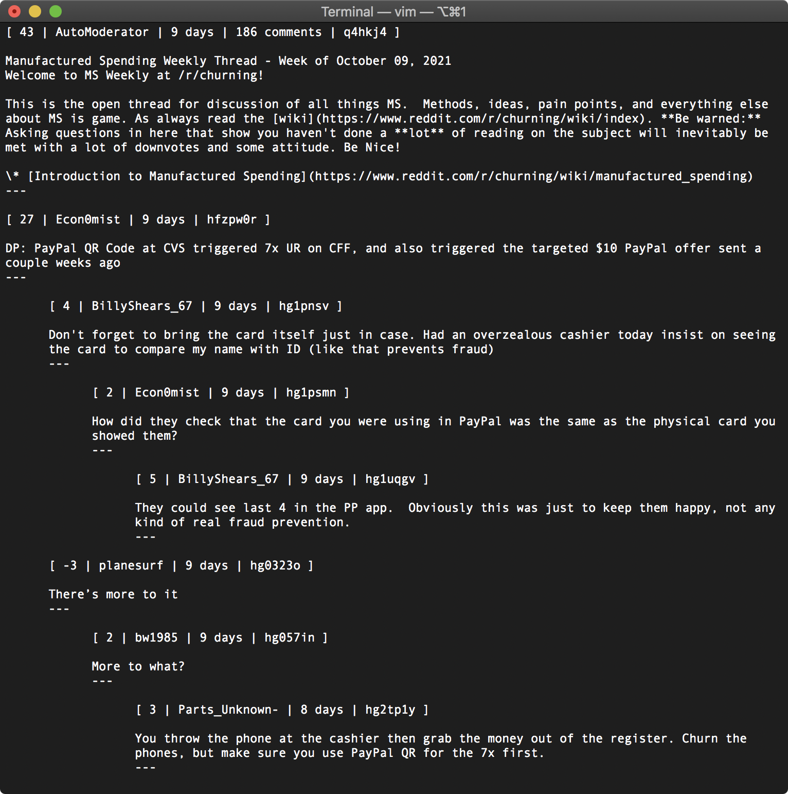

# bdfr2text
Converts output files from [Bulk Downloader for Reddit](https://github.com/aliparlakci/bulk-downloader-for-reddit) into pretty text files like this:



Issues and PRs are welcome.

## Usage
```
$ git clone https://github.com/DownrightNifty/bdfr2text.git
$ cd bdfr2text
$ python3 bdfr2text.py INPUT_DIR OUTPUT_DIR
```
See `python3 bdfr2text.py -h`.

Only JSON or YAML (not XML) output from BDFR is supported. If converting YAML files, PyYAML is necessary (but this should already have been installed by BDFR). Otherwise, no dependencies.

## Parsable output
The `--parsable-out` (`-p`) option produces a parsable output by escaping delimiters used by bdfr2text found in the Reddit posts. It replaces `[` with `&lsqb;`, `]` with `&rsqb;`, and `---` with `&#x2504;`.

## Searching through output
`--parsable-out` makes the output text files searchable with your favorite programs. Personally, I use Sublime Text, which can search entire folders and supports regex. For example, you could use the following regex to search for the string "query" within Reddit comments (excluding metadata blocks): `query(?=[^\]]+\[)`

## See also
* [bdfr-html](https://github.com/BlipRanger/bdfr-html)
